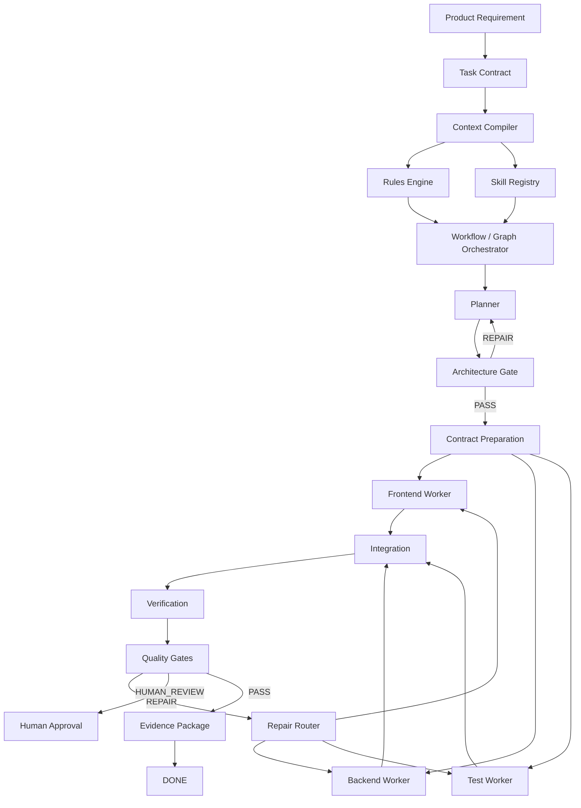

# Architecture

## Control plane

`.ai/` stores governance, workflows, schemas, runtime state and evidence.

## Project plane

`docs/`, application source and tests contain product-specific implementation and sources of truth.

## Specialist pattern

Software Architect, Database Architect, UX Architect and Security Reviewer are invoked only when their gate or change type requires specialist judgment. They are not permanent workers.
