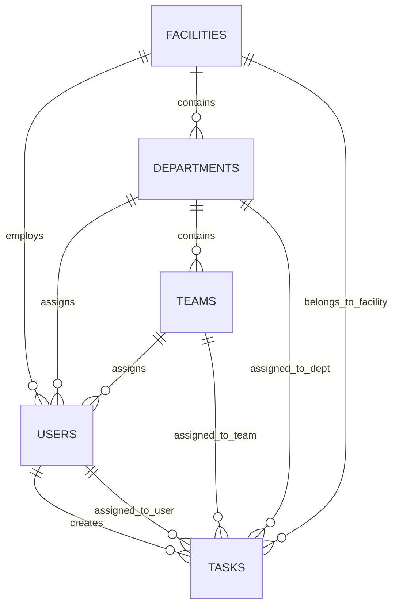

# WMS Database Foundation Baseline

Version: 1.0.0
Date: 2026-10-06
Status: APPROVED
Engine: PostgreSQL 15+

## 1. Schema Design Principles
1. **Strong Referential Integrity**: Explicit foreign keys with appropriate `ON DELETE` policies (`RESTRICT` or `CASCADE`).
2. **Auditability**: `created_at` and `updated_at` on every table.
3. **Multi-tier Organization**:
   - `facilities`: Primary organizational branches.
   - `departments`: Functional divisions inside a facility.
   - `teams`: Sub-units inside a department.
   - `users`: Attached to a primary facility, department, and team.
4. **Task Assignments**:
   - Explicit typed foreign keys (`assignee_user_id`, `assignee_team_id`, `assignee_department_id`).
   - `assignment_target_type`: Enum `USER`, `TEAM`, `DEPARTMENT`.

## 2. Core Entities (ER Overview)

## 3. Data Dictionary for Core Tables

### `facilities`
- `id` (UUID, PK)
- `name` (VARCHAR(150), NOT NULL)
- `code` (VARCHAR(50), UNIQUE, NOT NULL)
- `address` (TEXT, NULL)
- `manager_id` (UUID, FK -> users.id, NULL)
- `is_active` (BOOLEAN, DEFAULT true)
- `created_at`, `updated_at` (TIMESTAMP WITH TIME ZONE)

### `departments`
- `id` (UUID, PK)
- `facility_id` (UUID, FK -> facilities.id, NOT NULL)
- `name` (VARCHAR(100), NOT NULL)
- `code` (VARCHAR(50), NOT NULL)
- `manager_id` (UUID, FK -> users.id, NULL)
- `created_at`, `updated_at` (TIMESTAMP WITH TIME ZONE)

### `teams`
- `id` (UUID, PK)
- `department_id` (UUID, FK -> departments.id, NOT NULL)
- `name` (VARCHAR(100), NOT NULL)
- `leader_id` (UUID, FK -> users.id, NULL)
- `created_at`, `updated_at` (TIMESTAMP WITH TIME ZONE)

### `users`
- `id` (UUID, PK)
- `email` (VARCHAR(255), UNIQUE, NOT NULL)
- `password_hash` (VARCHAR(255), NOT NULL)
- `full_name` (VARCHAR(150), NOT NULL)
- `role` (ENUM: SUPER_ADMIN, ADMIN, FACILITY_MANAGER, DEPARTMENT_MANAGER, TEAM_LEADER, STAFF, TEACHER)
- `facility_id` (UUID, FK -> facilities.id, NULL)
- `department_id` (UUID, FK -> departments.id, NULL)
- `team_id` (UUID, FK -> teams.id, NULL)
- `manager_id` (UUID, FK -> users.id, NULL)
- `is_active` (BOOLEAN, DEFAULT true)
- `created_at`, `updated_at` (TIMESTAMP WITH TIME ZONE)

### `tasks`
- `id` (UUID, PK)
- `title` (VARCHAR(255), NOT NULL)
- `description` (TEXT, NULL)
- `status` (ENUM: NEW, ASSIGNED, IN_PROGRESS, BLOCKED, PENDING_REVIEW, COMPLETED, CANCELLED, OVERDUE)
- `priority` (ENUM: LOW, MEDIUM, HIGH, URGENT)
- `start_date` (TIMESTAMP WITH TIME ZONE, NULL)
- `due_date` (TIMESTAMP WITH TIME ZONE, NULL)
- `facility_id` (UUID, FK -> facilities.id, NOT NULL)
- `department_id` (UUID, FK -> departments.id, NULL)
- `team_id` (UUID, FK -> teams.id, NULL)
- `creator_id` (UUID, FK -> users.id, NOT NULL)
- `assignment_target_type` (ENUM: USER, TEAM, DEPARTMENT)
- `assignee_user_id` (UUID, FK -> users.id, NULL)
- `assignee_team_id` (UUID, FK -> teams.id, NULL)
- `assignee_department_id` (UUID, FK -> departments.id, NULL)
- `completed_at` (TIMESTAMP WITH TIME ZONE, NULL)
- `completed_by_id` (UUID, FK -> users.id, NULL)
- `created_at`, `updated_at` (TIMESTAMP WITH TIME ZONE)

## 4. Indexing Strategy
- `tasks(facility_id, status)` for quick facility-level task filtering.
- `tasks(assignee_user_id, status)` for "My Tasks" query.
- `tasks(due_date)` for calendar and overdue task queries.
- `users(email)` unique index for authentication lookup.
